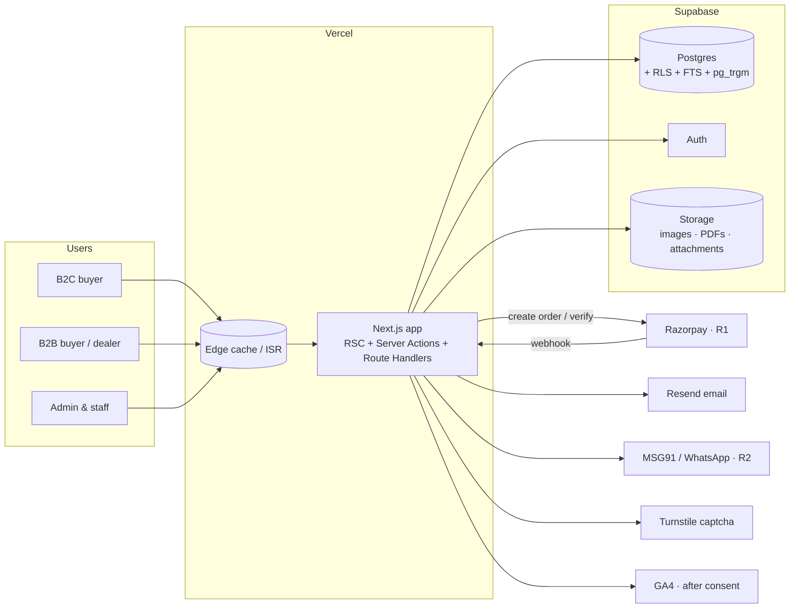
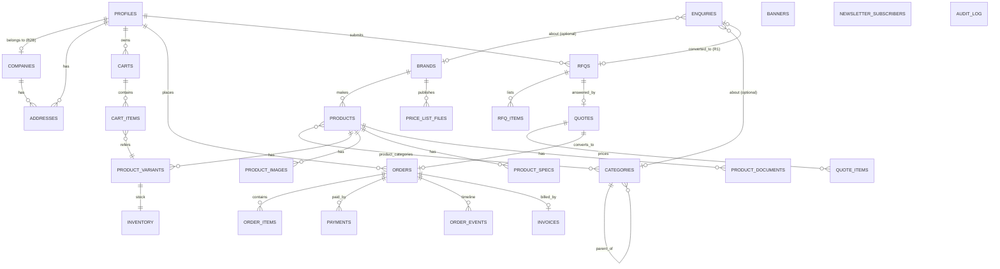
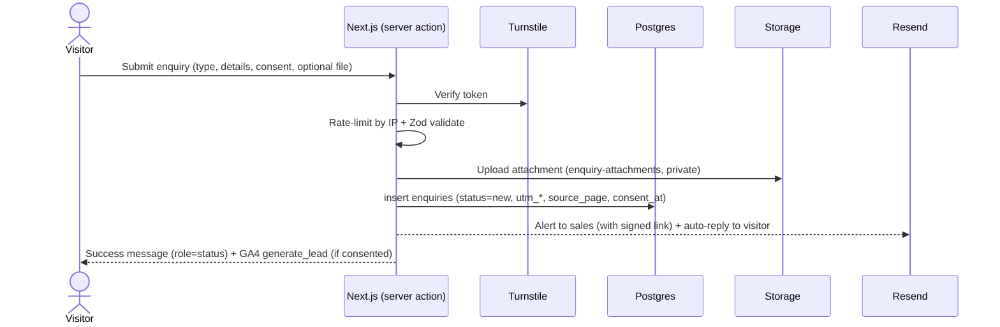
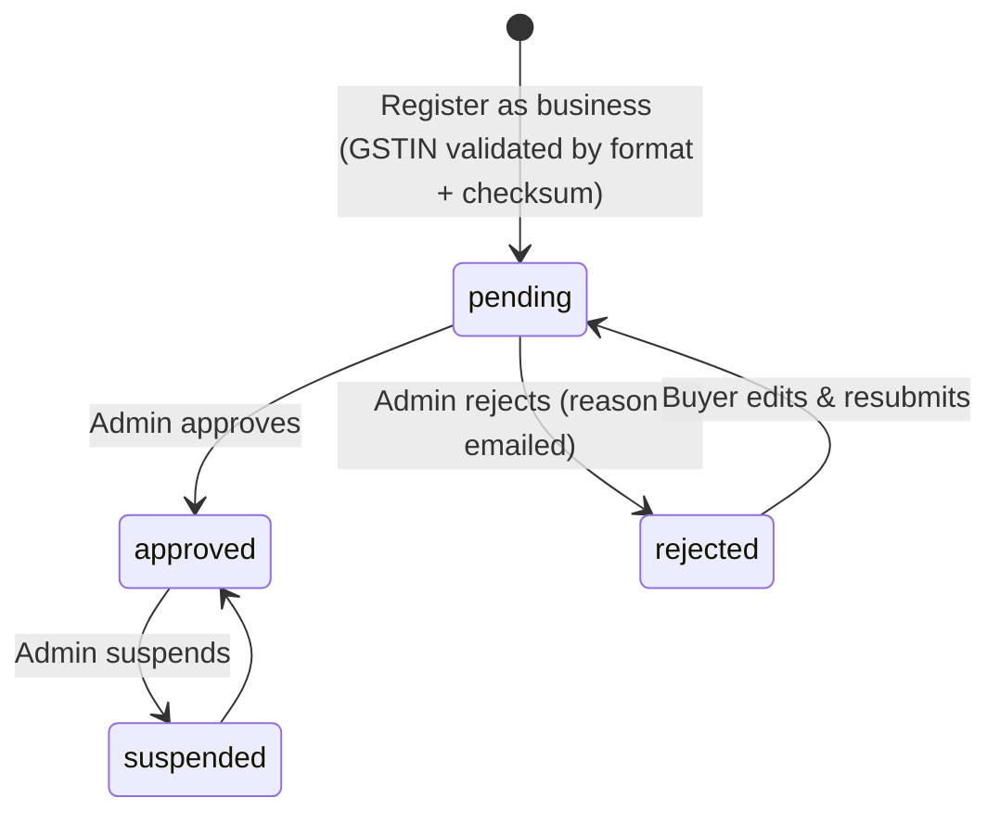
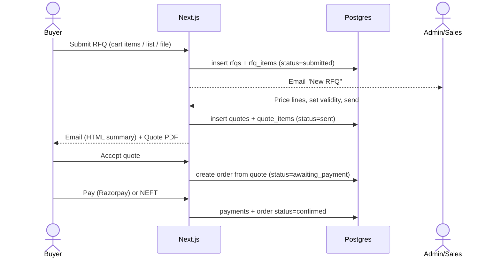
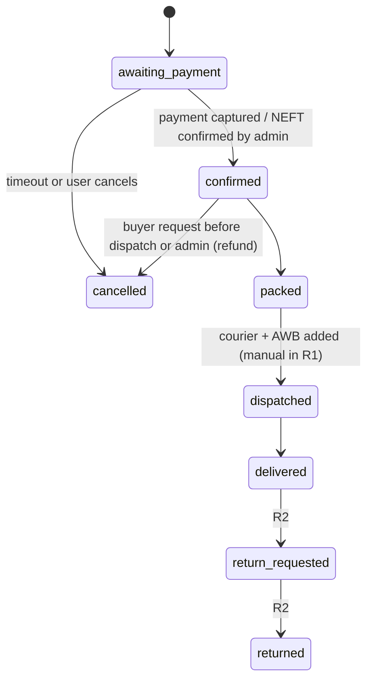

# Mojo Tools — Architecture

> **Version 0.2** (08 Oct 2026): consolidated and corrected. See [`CHANGELOG.md`](CHANGELOG.md).
> Living document: update it whenever a task in [`TASKS.md`](TASKS.md) changes structure (new module, table, route, env var, integration).
> Diagrams are Mermaid; they render on GitHub, VS Code and most Markdown viewers.
> Releases: **R0** company site · **R1** e-commerce MVP · **R2/R3** later ([`PRD.md §12`](PRD.md#12-release-plan)).

---

## 1. Architecture at a glance

- **One Next.js application** (App Router, TypeScript) serves three surfaces through route groups: the **presentation site** (R0), the **shop** (R1) and the **admin panel** (R1).
- **Supabase** provides Postgres (data + full-text search), Auth (email/password, Google; phone OTP in R2), Storage (images, PDFs, attachments) and Row-Level Security.
- **Vercel** hosts the app (edge CDN, ISR caching, cron).
- Third parties: **Resend** (email), **Cloudflare Turnstile** (captcha), **Google Maps** embed, **GA4** + **Sentry** (R0); **Razorpay** (payments, R1); **MSG91 / WhatsApp Cloud API** (OTP + notifications, R2); shipping aggregator (R2); Tally/ERP (R3).



## 2. Technology stack

| Layer | Choice | Why |
|---|---|---|
| Framework | Next.js (App Router), React, TypeScript (strict). **Current stable major at task T1.1 (15 or newer), then pinned.** | SSR/ISR for SEO, server actions, one codebase |
| Styling | Tailwind CSS v4 + CSS variables (design tokens) | Matches [`DESIGN.md §2`](DESIGN.md#2-design-tokens) tokens 1:1 |
| UI primitives | shadcn/ui (Radix) + lucide-react icons | Accessible, owned source |
| Forms & validation | React Hook Form + Zod (shared schemas client/server) via shadcn `<Form>` | One source of truth for validation; wires `aria-invalid` / `aria-describedby` |
| Data access | `@supabase/ssr` + generated DB types | RLS enforced, typed queries |
| Database | Supabase Postgres 15+, `pg_trgm`, `unaccent`, FTS | SKU/name search without an extra service |
| Auth | Supabase Auth | Email, Google (R1); phone OTP (R2) |
| Files | Supabase Storage (public: site media, brand logos, product images; private: enquiry attachments, price lists, invoices, RFQ attachments) | Signed URLs for gated files |
| Payments | Razorpay Orders API + webhooks (R1) | UPI/cards/netbanking, INR |
| PDF | `@react-pdf/renderer` (invoices, quotes, proforma; R1). Output is untagged, so every PDF has an HTML equivalent. | Server-generated, stored in Storage |
| Import | SheetJS (`xlsx`) + Zod row validation (R1) | Owner's catalogue arrives as XLSX/CSV |
| Email | Resend + React Email templates | Transactional email |
| i18n | `next-intl` with `localePrefix: 'as-needed'` (EN default, unprefixed; HI under `/hi` in R2) | UI strings only; no URL change when Hindi is added |
| Testing | Vitest (unit), Playwright (e2e) + **`@axe-core/playwright`** (accessibility), Supabase local for DB tests | |
| Quality | ESLint (+ **`eslint-plugin-jsx-a11y`**), Prettier, TypeScript, Husky + lint-staged, commitlint, GitHub Actions | |
| Monitoring | Vercel Analytics, Sentry, GA4 (consent-gated) | |

## 3. Route map

```mermaid
flowchart TB
  ROOT["app/[locale]  (EN unprefixed · /hi in R2)"]
  ROOT --> M["(marketing) · R0"]
  ROOT --> S["(shop) · R1"]
  ROOT --> A["(auth) · R1"]
  ROOT --> AC["account · R1"]
  ROOT --> AD["admin · R1"]

  M --> M1["/ Home"]
  M --> M2["/about"]
  M --> M3["/brands · /brands/[brand]"]
  M --> M4["/contact"]
  M --> M5["/policies/[slug]"]

  S --> S1["/shop (landing)"]
  S --> S2["/shop/c/[...category]"]
  S --> S3["/shop/b/[brand]"]
  S --> S4["/shop/p/[slug]"]
  S --> S5["/shop/search"]
  S --> S6["/shop/clearance · /shop/economy · /shop/offers"]
  S --> S7["/price-lists"]
  S --> S8["/quick-order · /rfq"]
  S --> S9["/cart · /checkout"]

  A --> A1["/auth/login · /register · /register/business · /reset · (/otp R2)"]

  AC --> AC1["/account (dashboard)"]
  AC --> AC2["orders · quotes · addresses · company · downloads"]

  AD --> AD1["dashboard · products · brands · categories · import"]
  AD --> AD2["orders · rfqs · customers · approvals"]
  AD --> AD3["price-lists · banners · enquiries · settings"]
```



Rendering strategy:

| Route type | Rendering |
|---|---|
| Marketing pages | Static + ISR (revalidate on content change) |
| Category / brand / product pages | ISR with on-demand revalidation by tag (`product:{id}`, `category:{id}`, `brand:{id}`) after admin edits |
| Search, cart, checkout, account | Dynamic (server-rendered per request) |
| Admin | Dynamic, `noindex`, role-gated in middleware **and** RLS |

## 4. Folder structure

```
mojo-tools/
├─ CLAUDE.md                  points every session to docs/README.md and RULES.md §0
├─ docs/                      README, PRD, ARCHITECTURE, RULES, DESIGN, TASKS, LAUNCH-PLAN,
│                             DECISIONS, OPEN-QUESTIONS, CHANGELOG
├─ design/                    exported approved designs (TASKS T0.7)
├─ public/                    favicons, static images
├─ supabase/
│  ├─ migrations/             SQL migrations (timestamped, never edited after merge)
│  ├─ tests/                  RLS / SQL tests
│  ├─ seed.sql                dev seed data (marked SEED)
│  └─ config.toml
├─ src/
│  ├─ app/
│  │  ├─ [locale]/
│  │  │  ├─ (marketing)/      home, about, brands, contact, policies          R0
│  │  │  ├─ (shop)/           shop, c, b, p, search, clearance, economy, offers,
│  │  │  │                    price-lists, quick-order, rfq, cart, checkout   R1
│  │  │  ├─ (auth)/           login, register, register/business, reset       R1
│  │  │  ├─ account/          dashboard, orders, quotes, addresses, company, downloads
│  │  │  └─ admin/            all admin screens                               R1
│  │  ├─ api/
│  │  │  ├─ webhooks/razorpay/route.ts                                        R1
│  │  │  ├─ cron/             expire-quotes, cancel-unpaid-orders             R1
│  │  │  └─ search/suggest/route.ts                                           R1
│  │  ├─ sitemap.ts, robots.ts
│  ├─ components/
│  │  ├─ ui/                  shadcn primitives (Button, Input, Dialog …)
│  │  ├─ layout/              UtilityBar, Header, MainNav, MegaMenu, MobileNav, Footer,
│  │  │                       SideWidget, WhatsAppFab, CookieBanner, SkipLink
│  │  ├─ marketing/           HeroCarousel, StatsStrip, ValuesAccordion, BrandGrid,
│  │  │                       EnquiryForm, ContactInfoCard, CTABand …
│  │  ├─ shop/                ProductCard, ProductRail, FilterSidebar, CategorySection,
│  │  │                       PriceBlock, QtyStepper, CartDrawer, QuickOrderTable …
│  │  └─ admin/               DataTable, ImportWizard, StatusBadge …
│  ├─ features/               domain logic, one folder per domain
│  │  ├─ enquiries/           R0: schemas, actions (submit), notify, attribution
│  │  ├─ content/             R0: brands, site content, hero slides; R1: banners, offers
│  │  ├─ analytics/           R0: event helpers, UTM capture, consent gate
│  │  ├─ catalog/             queries.ts, actions.ts, schemas.ts, types.ts      R1
│  │  ├─ search/  cart/  checkout/  orders/  rfq/                              R1
│  │  ├─ accounts/            B2C/B2B profiles, GSTIN verification             R1
│  │  ├─ pricing/             price resolution (single price R1; tiers R2)
│  │  ├─ tax/                 GST calculation, HSN, place of supply            R1
│  │  ├─ invoices/            PDF generation, numbering                        R1
│  │  ├─ price-lists/                                                          R1
│  │  └─ import/              XLSX/CSV import pipeline                         R1
│  ├─ lib/
│  │  ├─ supabase/            server.ts, client.ts, admin.ts (service role, server only)
│  │  ├─ email.ts, format.ts (₹, dates, phones), rate-limit.ts, turnstile.ts
│  │  ├─ razorpay.ts, pdf.ts, gstin.ts                                         R1
│  │  └─ env.ts               Zod-validated env vars
│  ├─ i18n/                   messages/en.json (hi.json in R2), routing config
│  ├─ styles/globals.css      design tokens
│  └─ middleware.ts           locale, consent cookie, auth session refresh (R1), admin guard (R1)
├─ tests/                     e2e (Playwright + axe), fixtures
└─ .github/workflows/ci.yml
```

## 5. Data model



### Key tables (columns abbreviated)

Every table has `id uuid`, `created_at`, `updated_at` (trigger) and RLS enabled ([`RULES.md §4`](RULES.md#database)).

| Table | Rel | Important columns |
|---|---|---|
| `brands` | **R0** | `name`, `slug`, `logo_path`, `description`, `product_types[]` (filter chips), `is_authorised` (badge shown only when true), `is_featured`, `sort`, `is_active` |
| `categories` | **R0** (top level) / R1 (tree) | `name`, `slug`, `parent_id`, `path` (ltree or text), `icon`, `image_path`, `image_alt`, `sort`, `spec_filters` (jsonb), `is_active` |
| `enquiries` | **R0** | `number` (`ENQ-YYYY-#####`), `type` (`contact`/`quote`/`price_list`/`dealer`/`support`), `name`, `company`, `mobile`, `email`, `gstin` (optional), `message`, `brand_id`?, `category_id`?, `attachment_path`?, `status` (`new`/`contacted`/`qualified`/`closed`/`spam`), `assigned_to`?, `source_page`, `utm_source`, `utm_medium`, `utm_campaign`, `referrer`, `consent_at`, `rfq_id`? (R1) |
| `newsletter_subscribers` | **R0** | `email`, `topic` (`newsletter`/`online_ordering_launch`), `consent_at`, `unsubscribed_at`, `source_page`, `utm_*` |
| `profiles` | R1 | `id (= auth.users.id)`, `full_name`, `phone`, `email`, `role` (`customer`/`staff`/`manager`/`owner`), `account_type` (`b2c`/`b2b`), `company_id` |
| `companies` | R1 | `legal_name`, `trade_name`, `gstin` (unique), `pan`, `state_code`, `status` (`pending`/`approved`/`rejected`/`suspended`), `approved_by`, `approved_at`, `rejection_reason`, `customer_group_id` *(R2)* |
| `products` | R1 | `name`, `slug`, `brand_id`, `description`, `hsn_code`, `gst_rate`, `unit`, `country_of_origin`, flags `is_clearance`, `is_economy`, `is_new`, `is_active`, `search_tsv` (generated) |
| `product_variants` | R1 | `product_id`, `sku` (unique, indexed, trigram), `attributes` jsonb, `mrp`, `price`, `moq`, `pack_size`, `weight_g`, `is_default`. Every product has ≥ 1 variant. |
| `product_images` | R1 | `product_id`, `path`, `alt`, `sort` |
| `inventory` | R1 | `variant_id`, `on_hand`, `reserved`, `status` (`in_stock`/`low`/`out`/`on_request`) |
| `price_tiers` | R2 | `variant_id`, `customer_group_id`, `min_qty`, `price` |
| `carts` / `cart_items` | R1 | `profile_id` or `guest_token`; `variant_id`, `qty` |
| `rfqs` / `rfq_items` | R1 | `number` (`RFQ-YYYY-#####`), `profile_id`, `company_id`, `enquiry_id`?, `status`, `message`, `attachment_path`, `required_by`; items: `variant_id` *or* free-text `description`, `qty`, `unit` |
| `quotes` / `quote_items` | R1 | `rfq_id`, `number` (`QT-YYYY-#####`), `valid_until`, `subtotal`, `tax`, `total`, `pdf_path`, `status`; items: `unit_price`, `qty`, `gst_rate` |
| `orders` / `order_items` | R1 | `number` (`MT-YYYY-#####`), `profile_id`, `company_id`, `gstin`, addresses (snapshot jsonb), `place_of_supply`, `status`, `payment_method`, `subtotal`, `cgst`, `sgst`, `igst`, `shipping`, `total`, `quote_id`, `courier`, `awb`, `tracking_url`; items snapshot name/SKU/HSN/price/GST |
| `payments` | R1 | `order_id`, `provider` (`razorpay`/`neft`/`cod`), `provider_order_id`, `provider_payment_id`, `amount`, `status`, `raw` jsonb |
| `invoices` | R1 | `order_id`, `number` (per FY sequence, e.g. `MT/26-27/00001`), `pdf_path`, `issued_at` |
| `order_events` | R1 | `order_id`, `status`, `note`, `actor_id`, `created_at` |
| `price_list_files` | R1 | `brand_id`, `title`, `effective_date`, `file_path` (private), `visibility` (`b2b_approved`/`public`) |
| `banners` | R1 | `placement` (`home_hero`/`shop_hero`/`promo_tile`/`offer_card`), `title`, `subtitle`, `cta_label`, `cta_href`, `image_path`, `image_alt`, `starts_at`, `ends_at`, `sort` |
| `audit_log` | R1 | `actor_id`, `entity`, `entity_id`, `action`, `diff` jsonb |

In R0, hero slides, stats, values, timeline and company copy live in typed content files under `src/features/content/` (migrated to `banners` / admin in R1).

### Storage buckets

| Bucket | Access | Rel | Limits |
|---|---|---|---|
| `public-media` | Public | R0 | Site photos, brand logos, category images, product images (R1) |
| `enquiry-attachments` | Private (staff only, signed URLs ≤ 10 min) | R0 | PDF, XLSX, CSV, JPG, PNG, WEBP; ≤ 10 MB |
| `price-lists`, `invoices`, `rfq-attachments` | Private | R1 | Same file rules |

### Money & tax rules
- All money is stored in the DB as **paise in `bigint`**; it is formatted only at the edge.
- Prices stored **inclusive of GST** for display 🟡 (confirm). The tax split is computed at order time and snapshotted on `order_items`.
- Place of supply: buyer's state (from GSTIN or shipping address) vs Mojo's state (from Mojo's GSTIN ❓) → **CGST+SGST** (same state) or **IGST** (different state).

## 6. Core flows

### 6.0 Enquiry (R0)

Sales works enquiries from email in R0 and updates `status` (initially through the Supabase dashboard). The R1 admin inbox adds "Convert to RFQ", which creates an `rfqs` row linked by `enquiry_id`.

### 6.1 B2B account verification (R1)

Approved accounts unlock: GSTIN on invoices, NEFT payment option, price-list downloads, RFQ history and quote acceptance.

### 6.2 RFQ → Quote → Order (R1)

RFQ statuses: `submitted → in_review → quoted → accepted | rejected | expired`. A cron job expires quotes after `valid_until`.

### 6.3 Order lifecycle (R1)

Every transition writes an `order_events` row and may trigger email.

### 6.4 Payment (Razorpay, R1)
1. Checkout server action creates the `orders` row (`awaiting_payment`) and a Razorpay Order (amount in paise), with totals re-priced on the server.
2. Client opens Razorpay Checkout.
3. On success the client posts the signature → server verifies the HMAC → marks payment `captured`.
4. **Webhook `payment.captured` is the source of truth** (idempotent by `provider_payment_id`); it handles closed-tab cases.

### 6.5 Catalogue import (R1)
`Upload XLSX → parse (SheetJS) → validate rows (Zod) → preview with errors → upsert by SKU in a transaction → revalidate tags → import report`. Images are matched by filename = SKU (`SKU.jpg`, `SKU_2.jpg`); alt text defaults to "{Brand} {Product name}".

## 7. Search (R1)
- `products.search_tsv` = weighted tsvector (name A, brand B, category C, description D).
- `product_variants.sku` with a `pg_trgm` GIN index.
- Query order: **exact SKU → SKU prefix → FTS rank → trigram similarity on name**.
- `/api/search/suggest` returns the top 8 with thumbnail, brand, SKU, price; debounced 200 ms; target < 300 ms p95.
- If the catalogue grows past ~100k SKUs or needs facets at scale → move to Meilisearch/Typesense (adapter in `features/search`, R3).

## 8. Security model
- **RLS on every table.** Public read only for active catalogue/content rows. `enquiries` and `newsletter_subscribers`: **insert only via server action (service role); no public read**; staff read. Customers read/write only their own carts, orders, RFQs, addresses.
- Staff access via `role` in `profiles`, checked by an `is_staff()` SQL function used in policies (R1; in R0 only the service role and Supabase dashboard users touch enquiries).
- Service-role key only in server code (`lib/supabase/admin.ts`, `import "server-only"`), never shipped to the client.
- Private buckets served through short-lived signed URLs (≤ 10 min) after a permission check.
- Turnstile (managed/invisible mode) + rate limiting on enquiry, newsletter, register and RFQ forms and on auth.
- Admin requires MFA (Supabase TOTP).
- Security headers (CSP, HSTS, frame-ancestors) from R0.

## 9. Environments & deployment

| Env | Hosting | Database | Notes |
|---|---|---|---|
| Local | `next dev` | Supabase CLI local stack | seed data |
| Preview | Vercel preview per PR | Supabase branch | test keys; Turnstile test keys |
| Production | Vercel prod | Supabase prod | live keys, daily backups (PITR) |

CI (GitHub Actions): typecheck → lint (incl. jsx-a11y) → unit tests → build → Playwright smoke + **axe** on preview (fail on serious/critical violations).

## 10. Integrations

| Integration | Release | Purpose |
|---|---|---|
| Resend | R0 | Enquiry alerts, auto-replies; transactional email from R1 |
| Cloudflare Turnstile | R0 | Captcha (managed mode) |
| Google Maps embed | R0 | Contact page (with text address + directions link) |
| GA4 + Vercel Analytics + Sentry | R0 | Analytics (consent-gated), errors |
| Google Search Console | R0 | Indexing, sitemap |
| Razorpay | R1 | Online payments, refunds |
| MSG91 / WhatsApp Cloud API | R2 | Phone OTP, order/quote notifications |
| Shipping aggregator (e.g. Shiprocket) | R2 | Rates, AWB, tracking (R1 = manual AWB entry) |
| Tally / ERP sync | R3 | Stock & price sync |

## 11. Analytics & attribution

Supports the launch campaign targets in [`LAUNCH-PLAN.md`](LAUNCH-PLAN.md).

- **Consent first:** GA4 loads only after the visitor accepts analytics cookies (DPDP). Server-side counts (enquiries table) work without consent.
- **UTM capture:** on first landing, `utm_source/medium/campaign` and `referrer` go into a first-party cookie (30 days). They are saved on `enquiries` and `newsletter_subscribers` rows.
- **WhatsApp attribution:** click-to-chat links prefill "Hi, I'm interested in {page/brand} [via website]".

| Event (GA4) | Rel | Fires when | Parameters |
|---|---|---|---|
| `generate_lead` | R0 | Enquiry submitted successfully | `enquiry_type`, `brand`, `category`, `source_page` |
| `whatsapp_click` | R0 | Any WhatsApp CTA | `placement`, `page` |
| `call_click` | R0 | Any `tel:` link | `placement`, `page` |
| `price_list_request` | R0 | Enquiry type = price list | `brand` |
| `brand_view` | R0 | Brand page view | `brand` |
| `notify_signup` | R0 | Newsletter / launch notify signup | `topic`, `page` |
| `search`, `view_item`, `add_to_cart`, `begin_checkout`, `purchase`, `rfq_submit` | R1 | Shop funnel | standard GA4 e-commerce params |

## 12. R0 slice (what the company site actually uses)

| Piece | R0 use |
|---|---|
| `(marketing)` route group | Home, About, Brands, `/brands/[brand]`, Contact, `/policies/{terms,privacy,accessibility}` |
| Tables | `brands`, `categories` (top level, `is_active`), `enquiries`, `newsletter_subscribers` |
| Buckets | `public-media`, `enquiry-attachments` |
| Features | `enquiries`, `content`, `analytics` |
| Integrations | Resend, Turnstile, Maps, GA4, Sentry, Vercel Analytics, Search Console |
| **Not used in R0** | Supabase Auth, Razorpay, react-pdf, SheetJS, search, MSG91, carts/orders/RFQ/quotes/invoices tables, cron, admin panel |

Built so R1 slots in without migration: same codebase, same URLs, the `brands` schema is final, and enquiries convert to RFQs.

## 13. Decision log

All decisions (architecture and project) live in [`DECISIONS.md`](DECISIONS.md). Architecture decisions keep their IDs D1–D6 there.
