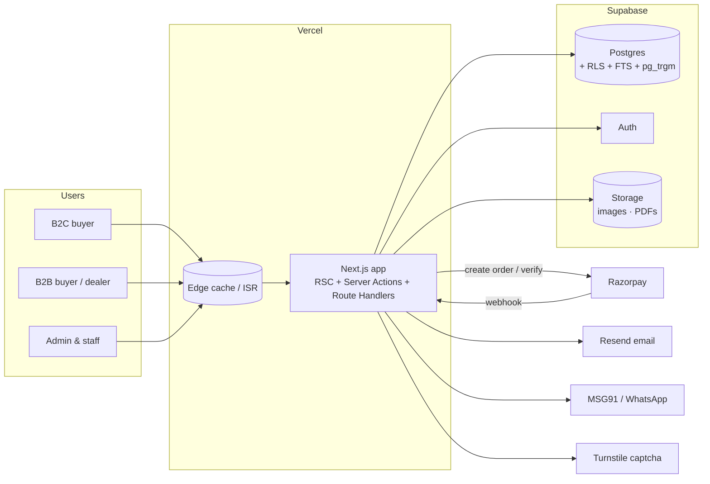
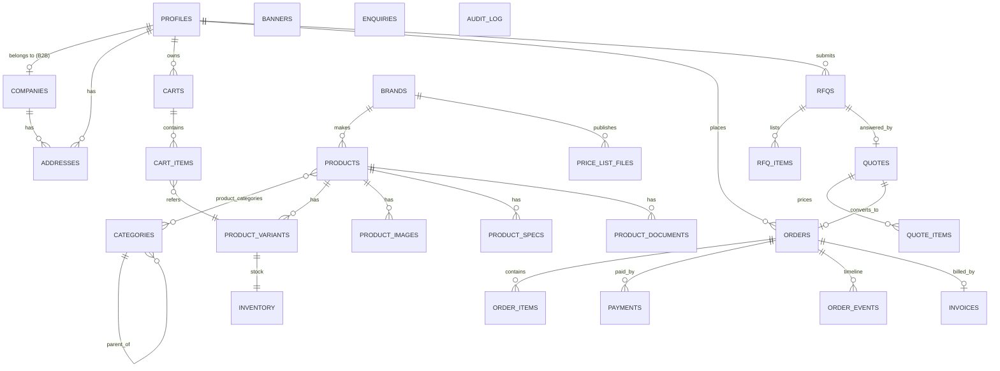
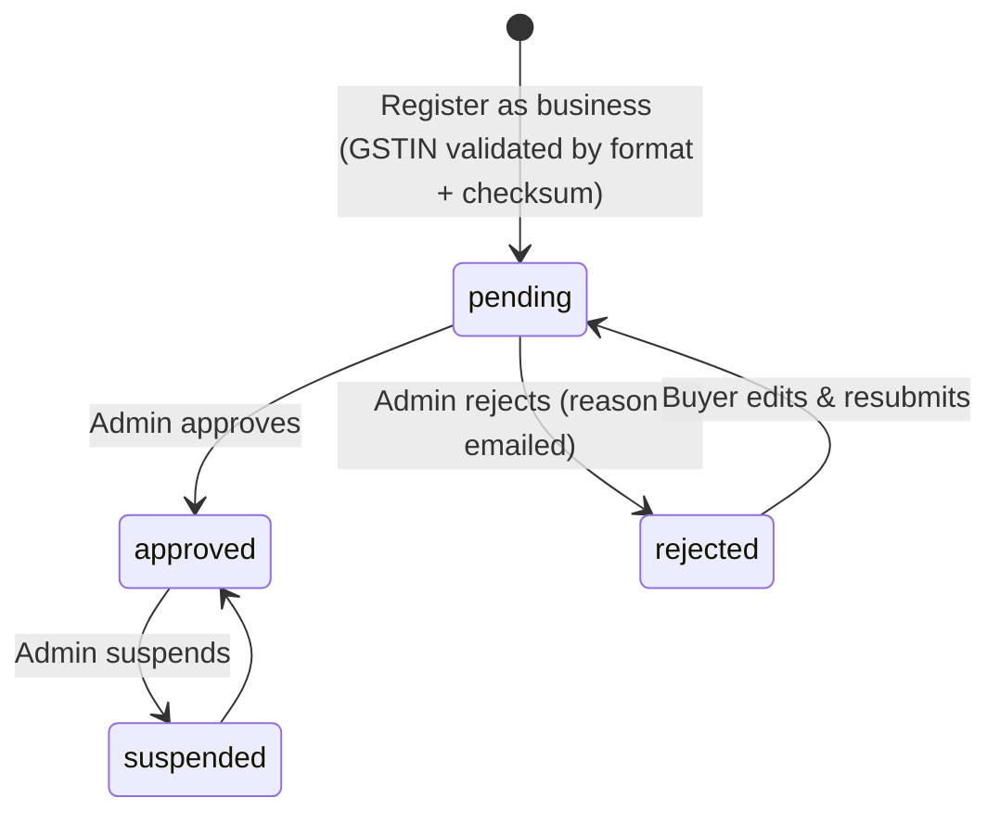
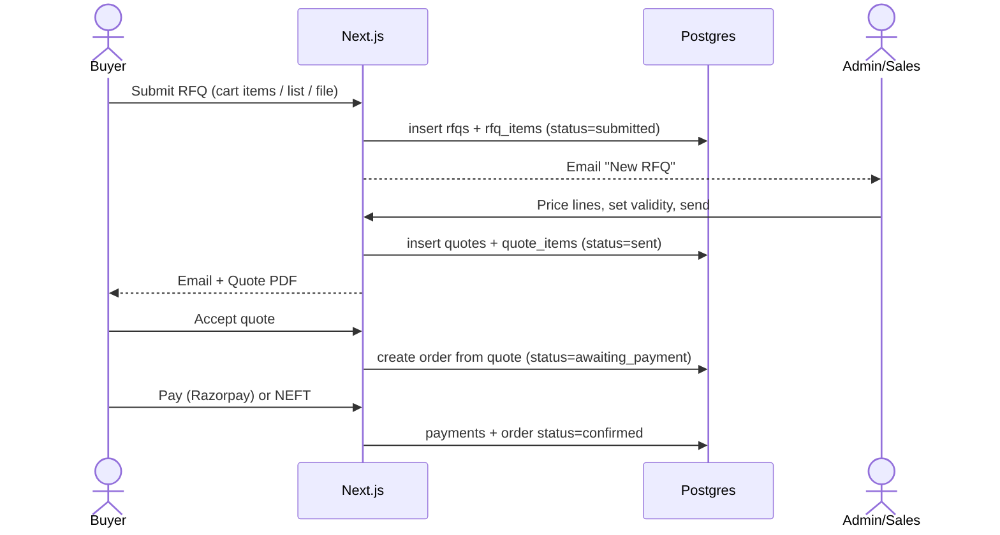
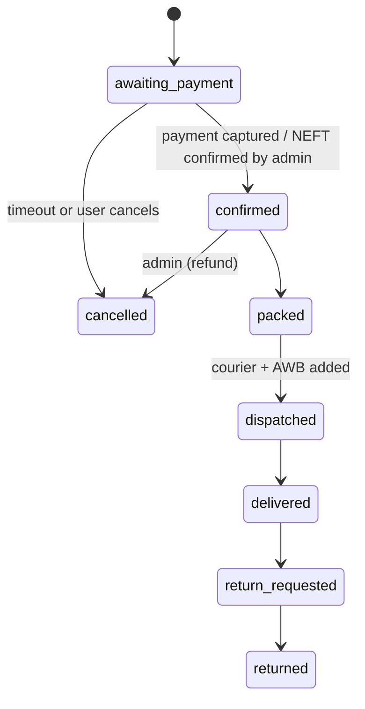

# Mojo Tools — Architecture

> Living document. Update it whenever a phase in `TASKS.md` changes structure (new module, table, integration).
> Diagrams are Mermaid and render on GitHub, VS Code and most Markdown viewers.

---

## 1. Architecture at a glance

- **One Next.js application** (App Router, TypeScript) serves three surfaces through route groups: the **presentation site**, the **shop**, and the **admin panel**.
- **Supabase** provides Postgres (data + full-text search), Auth (email/password, phone OTP, Google), Storage (images, PDFs) and Row-Level Security.
- **Vercel** hosts the app (edge CDN, ISR caching, cron).
- Third parties: **Razorpay** (payments), **Resend** (email), **MSG91 / WhatsApp Cloud API** (OTP/notifications, R2), **Google Maps** embed, **Cloudflare Turnstile** (captcha), **GA4**.



## 2. Technology stack

| Layer | Choice | Why |
|---|---|---|
| Framework | Next.js 15 (App Router), React 19, TypeScript (strict) | SSR/ISR for SEO, server actions, one codebase |
| Styling | Tailwind CSS v4 + CSS variables (design tokens) | Matches `DESIGN.md` tokens 1:1 |
| UI primitives | shadcn/ui (Radix) + lucide-react icons | Accessible, owned source |
| Forms & validation | React Hook Form + Zod (shared schemas client/server) | One source of truth for validation |
| Data access | `@supabase/ssr` + generated DB types | RLS enforced, typed queries |
| Database | Supabase Postgres 15, `pg_trgm`, `unaccent`, FTS | SKU/name search without extra service |
| Auth | Supabase Auth | Email, phone OTP, Google |
| Files | Supabase Storage (public: product images, brand logos; private: price lists, invoices, RFQ attachments) | Signed URLs for gated files |
| Payments | Razorpay Orders API + webhooks | UPI/cards/netbanking, INR |
| PDF | `@react-pdf/renderer` (invoices, quotes, proforma) | Server-generated, stored in Storage |
| Import | SheetJS (`xlsx`) + Zod row validation | Owner's catalogue arrives as XLSX/CSV |
| Email | Resend + React Email templates | Transactional email |
| i18n | `next-intl` (EN default, HI in R2) | UI strings only |
| Testing | Vitest (unit), Playwright (e2e), Supabase local for DB tests | |
| Quality | ESLint, Prettier, TypeScript, Husky + lint-staged, GitHub Actions | |
| Monitoring | Vercel Analytics, Sentry, GA4 | |

## 3. Route map

```mermaid
flowchart TB
  ROOT["app/[locale]"]
  ROOT --> M["(marketing)"]
  ROOT --> S["(shop)"]
  ROOT --> A["(auth)"]
  ROOT --> AC["account"]
  ROOT --> AD["admin"]

  M --> M1["/ Home"]
  M --> M2["/about"]
  M --> M3["/brands · /brands/[brand]"]
  M --> M4["/contact"]
  M --> M5["/policies/[slug]"]

  S --> S1["/shop (landing)"]
  S --> S2["/shop/c/[...category]"]
  S --> S3["/shop/b/[brand]"]
  S --> S4["/shop/p/[slug]"]
  S --> S5["/shop/search"]
  S --> S6["/shop/clearance · /shop/economy · /shop/offers"]
  S --> S7["/price-lists"]
  S --> S8["/quick-order · /rfq"]
  S --> S9["/cart · /checkout"]

  A --> A1["/auth/login · /register · /register/business · /otp · /reset"]

  AC --> AC1["/account (dashboard)"]
  AC --> AC2["orders · quotes · addresses · company · downloads"]

  AD --> AD1["dashboard · products · brands · categories · import"]
  AD --> AD2["orders · rfqs · customers · approvals"]
  AD --> AD3["price-lists · banners · enquiries · settings"]
```



Rendering strategy:

| Route type | Rendering |
|---|---|
| Marketing pages | Static + ISR (revalidate on content change) |
| Category / brand / product pages | ISR with on-demand revalidation by tag (`product:{id}`, `category:{id}`) after admin edits |
| Search, cart, checkout, account | Dynamic (server-rendered per request) |
| Admin | Dynamic, `noindex`, role-gated in middleware **and** RLS |

## 4. Folder structure

```
mojo-tools/
├─ docs/                      PRD.md, ARCHITECTURE.md, RULES.md, DESIGN.md, TASKS.md
├─ public/                    favicons, static images, robots
├─ supabase/
│  ├─ migrations/             SQL migrations (timestamped, never edited after merge)
│  ├─ seed.sql                dev seed data
│  └─ config.toml
├─ src/
│  ├─ app/
│  │  ├─ [locale]/
│  │  │  ├─ (marketing)/      home, about, brands, contact, policies
│  │  │  ├─ (shop)/           shop, c, b, p, search, clearance, economy, offers,
│  │  │  │                    price-lists, quick-order, rfq, cart, checkout
│  │  │  ├─ (auth)/           login, register, register/business, otp, reset
│  │  │  ├─ account/          dashboard, orders, quotes, addresses, company, downloads
│  │  │  └─ admin/            all admin screens
│  │  ├─ api/
│  │  │  ├─ webhooks/razorpay/route.ts
│  │  │  ├─ cron/             e.g. expire-quotes, abandoned-cart
│  │  │  └─ search/suggest/route.ts
│  │  ├─ sitemap.ts, robots.ts
│  ├─ components/
│  │  ├─ ui/                  shadcn primitives (Button, Input, Dialog …)
│  │  ├─ layout/              TopBar, MainNav, MegaMenu, Footer, SideWidget, WhatsAppFab
│  │  ├─ marketing/           HeroCarousel, StatsStrip, ValuesAccordion, BrandGrid …
│  │  ├─ shop/                ProductCard, ProductRail, FilterSidebar, CategorySection,
│  │  │                       PriceBlock, QtyStepper, CartDrawer, QuickOrderTable …
│  │  └─ admin/               DataTable, ImportWizard, StatusBadge …
│  ├─ features/               domain logic, one folder per domain
│  │  ├─ catalog/             queries.ts, actions.ts, schemas.ts, types.ts
│  │  ├─ search/
│  │  ├─ cart/
│  │  ├─ checkout/
│  │  ├─ orders/
│  │  ├─ rfq/
│  │  ├─ accounts/            B2C/B2B profiles, GSTIN verification
│  │  ├─ pricing/             price resolution (single price now; tiers in R2)
│  │  ├─ tax/                 GST calculation, HSN, place of supply
│  │  ├─ invoices/            PDF generation, numbering
│  │  ├─ price-lists/
│  │  ├─ content/             banners, offers, pages
│  │  └─ import/              XLSX/CSV import pipeline
│  ├─ lib/
│  │  ├─ supabase/            server.ts, client.ts, admin.ts (service role, server only)
│  │  ├─ razorpay.ts, email.ts, pdf.ts, format.ts (₹, dates), gstin.ts
│  │  └─ env.ts               Zod-validated env vars
│  ├─ i18n/                   messages/en.json, messages/hi.json, config
│  ├─ styles/globals.css      design tokens
│  └─ middleware.ts           locale, auth session refresh, admin guard
├─ tests/                     e2e (Playwright), fixtures
└─ .github/workflows/ci.yml
```

## 5. Data model



### Key tables (columns abbreviated)

| Table | Important columns |
|---|---|
| `profiles` | `id (= auth.users.id)`, `full_name`, `phone`, `email`, `role` (`customer`/`staff`/`manager`/`owner`), `account_type` (`b2c`/`b2b`), `company_id` |
| `companies` | `legal_name`, `trade_name`, `gstin` (unique), `pan`, `state_code`, `status` (`pending`/`approved`/`rejected`), `approved_by`, `approved_at`, `rejection_reason`, `customer_group_id` *(R2)* |
| `brands` | `name`, `slug`, `logo_path`, `description`, `product_types[]` (for filter chips), `is_featured`, `sort` |
| `categories` | `name`, `slug`, `parent_id`, `path` (ltree or text), `icon`, `image_path`, `sort`, `spec_filters` (jsonb: which spec keys are filterable) |
| `products` | `name`, `slug`, `brand_id`, `description`, `hsn_code`, `gst_rate`, `unit`, `country_of_origin`, flags `is_clearance`, `is_economy`, `is_new`, `is_active`, `search_tsv` (generated) |
| `product_variants` | `product_id`, `sku` (unique, indexed, trigram), `attributes` jsonb, `mrp`, `price`, `moq`, `pack_size`, `weight_g`, `is_default` |
| `inventory` | `variant_id`, `on_hand`, `reserved`, `status` (`in_stock`/`low`/`out`/`on_request`) |
| `price_tiers` *(R2)* | `variant_id`, `customer_group_id`, `min_qty`, `price` |
| `carts` / `cart_items` | `profile_id` or `guest_token`; `variant_id`, `qty` |
| `rfqs` / `rfq_items` | `number` (RFQ-YYYY-#####), `profile_id`, `company_id`, `status`, `message`, `attachment_path`; items: `variant_id` *or* free-text `description`, `qty` |
| `quotes` / `quote_items` | `rfq_id`, `number` (QT-…), `valid_until`, `subtotal`, `tax`, `total`, `pdf_path`, `status`; items: `unit_price`, `qty`, `gst_rate` |
| `orders` / `order_items` | `number` (MT-YYYY-#####), `profile_id`, `company_id`, `gstin`, addresses (snapshot jsonb), `place_of_supply`, `status`, `payment_method`, `subtotal`, `cgst`, `sgst`, `igst`, `shipping`, `total`, `quote_id`; items snapshot name/SKU/HSN/price/GST |
| `payments` | `order_id`, `provider` (`razorpay`/`neft`/`cod`), `provider_order_id`, `provider_payment_id`, `amount`, `status`, `raw` jsonb |
| `invoices` | `order_id`, `number` (per FY sequence, e.g. `MT/26-27/00001`), `pdf_path`, `issued_at` |
| `order_events` | `order_id`, `status`, `note`, `actor_id`, `created_at` |
| `price_list_files` | `brand_id`, `title`, `effective_date`, `file_path` (private), `visibility` (`b2b_approved`/`public`) |
| `banners` | `placement` (`home_hero`/`shop_hero`/`promo_tile`/`offer_card`), `title`, `subtitle`, `cta_label`, `cta_href`, `image_path`, `starts_at`, `ends_at`, `sort` |
| `enquiries` | contact form submissions |
| `audit_log` | `actor_id`, `entity`, `entity_id`, `action`, `diff` jsonb |

### Money & tax rules
- All money in **paise as `bigint`** in the DB; format only at the edge.
- Prices stored **inclusive of GST** for display 🟡 (confirm); tax split computed at order time and snapshotted on `order_items`.
- Place of supply: buyer's state (from GSTIN or shipping address) vs Mojo's state → **CGST+SGST** (same state) or **IGST** (different state).

## 6. Core flows

### 6.1 B2B account verification

Approved accounts unlock: GSTIN on invoices, NEFT payment option, price-list downloads, RFQ history and quote acceptance.

### 6.2 RFQ → Quote → Order

RFQ statuses: `submitted → in_review → quoted → accepted | rejected | expired`. A cron job expires quotes after `valid_until`.

### 6.3 Order lifecycle

Every transition writes an `order_events` row and may trigger email.

### 6.4 Payment (Razorpay)
1. Checkout server action creates `orders` row (`awaiting_payment`) and a Razorpay Order (amount in paise).
2. Client opens Razorpay Checkout.
3. On success the client posts the signature → server verifies HMAC → marks payment `captured`.
4. **Webhook `payment.captured` is the source of truth** (idempotent by `provider_payment_id`); handles closed-tab cases.

### 6.5 Catalogue import
`Upload XLSX → parse (SheetJS) → validate rows (Zod) → preview with errors → upsert by SKU in a transaction → revalidate tags → import report`. Images matched by filename = SKU (`SKU.jpg`, `SKU_2.jpg`).

## 7. Search
- `products.search_tsv` = weighted tsvector (name A, brand B, category C, description D).
- `product_variants.sku` with `pg_trgm` GIN index.
- Query order: **exact SKU → SKU prefix → FTS rank → trigram similarity on name**.
- `/api/search/suggest` returns top 8 with thumbnail, brand, SKU, price; debounced 200 ms.
- If catalogue grows past ~100k SKUs or needs facets at scale → move to Meilisearch/Typesense (adapter in `features/search`).

## 8. Security model
- **RLS on every table.** Public read only for active catalogue/content rows. Customers read/write only their own carts, orders, RFQs, addresses.
- Staff access via `role` in `profiles` checked by a `is_staff()` SQL function used in policies.
- Service-role key only in server code (`lib/supabase/admin.ts`), never shipped to the client.
- Private buckets (`price-lists`, `invoices`, `rfq-attachments`) served through short-lived signed URLs after permission check.
- Turnstile on contact, register and RFQ forms; rate limiting on auth and form endpoints.
- Admin requires MFA (Supabase TOTP).

## 9. Environments & deployment

| Env | Hosting | Database | Notes |
|---|---|---|---|
| Local | `next dev` | Supabase CLI local stack | seed data |
| Preview | Vercel preview per PR | Supabase branch | Razorpay test keys |
| Production | Vercel prod | Supabase prod | Razorpay live keys, backups daily (PITR) |

CI (GitHub Actions): typecheck → lint → unit tests → build → Playwright smoke on preview.

## 10. Integrations

| Integration | Phase | Purpose |
|---|---|---|
| Razorpay | R1 | Online payments, refunds |
| Resend | R1 | Transactional email |
| Cloudflare Turnstile | R1 | Captcha |
| Google Maps embed | R1 | Contact page |
| GA4 + Sentry | R1 | Analytics, errors |
| MSG91 / WhatsApp Cloud API | R2 | Phone OTP, order updates |
| Shiprocket (or similar) | R2 | Rates, AWB, tracking |
| Tally / ERP sync | R3 | Stock & price sync |

## 11. Decision log

| # | Date | Decision | Status |
|---|---|---|---|
| D1 | 07-10-2026 | Single Next.js app with route groups for site, shop, admin | 🟡 |
| D2 | 07-10-2026 | Supabase (Postgres + Auth + Storage) | 🟡 |
| D3 | 07-10-2026 | Postgres FTS + trigram for search at launch | ✅ |
| D4 | 07-10-2026 | Launch B2B = RFQ + GST invoices + business verification; tiers R2; credit R3 | ✅ |
| D5 | 07-10-2026 | Money stored as paise `bigint` | ✅ |
| D6 | 07-10-2026 | Admin panel is the inventory master; XLSX import | 🟡 |
